# 🦎 xBacked Testnet - UI Suggestions

<h2 id='user-flow'><strong>👩🏻‍💻</strong> Product User Flow</h2>

Let's walk through xBacked’s Testnet together from the perspective of new and returning users in a hypothetical case study...

<h4>🌸 STEP 1</h4>

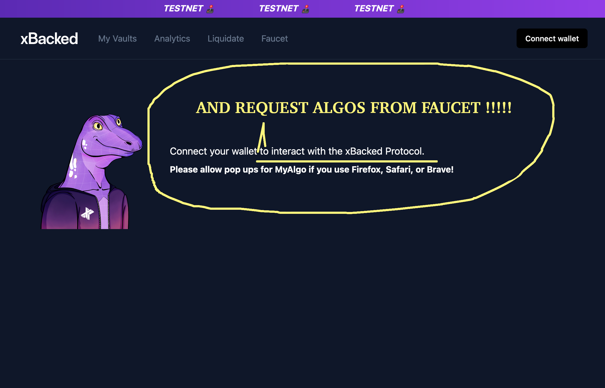
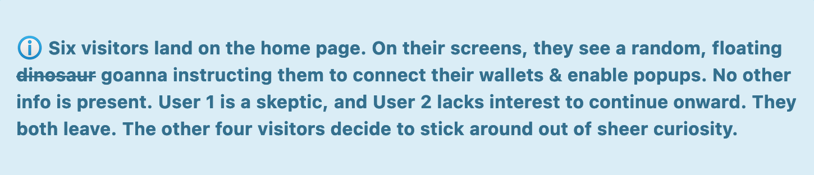

 

<h4>🌸 STEP 2</h4>

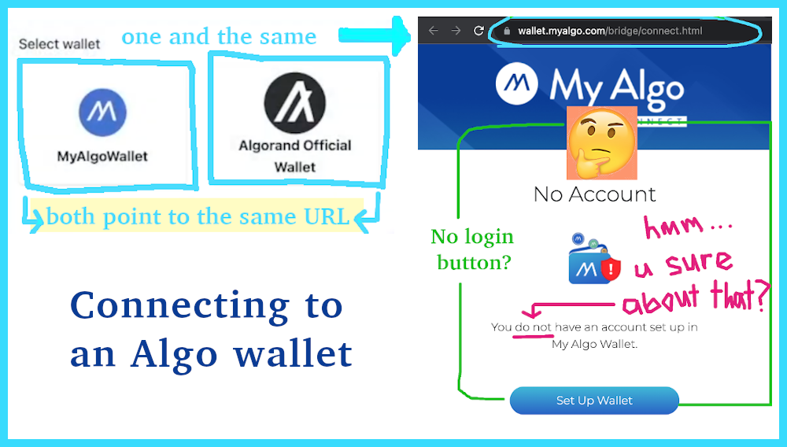
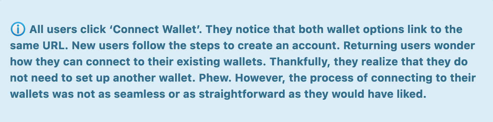

 

<h4>🌸 STEP 3</h4>

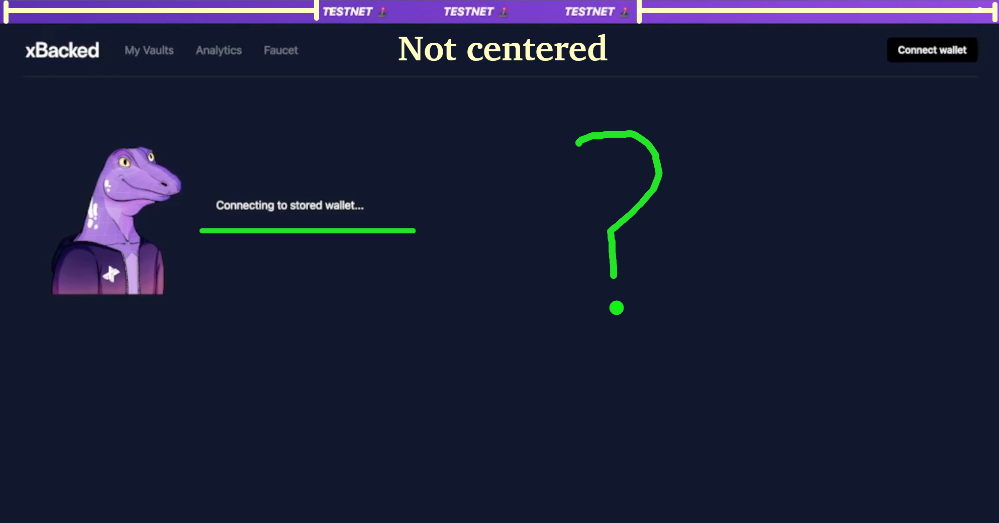  
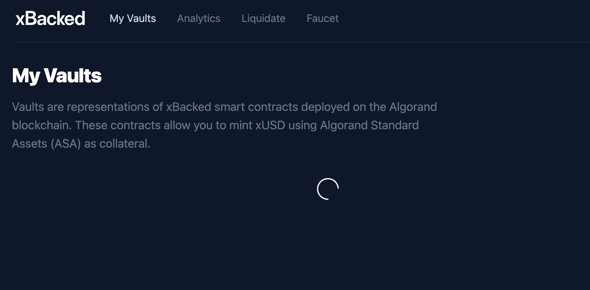  

<table width='300'>
    <tr>
        <td width='300' align='center'>  </td>
        <td width='300'>  </td>
        </tr>
        <tr>
        <td width='300' align='center'>  </td>
        <td width='290'> &nbsp;  &nbsp;  &nbsp;  </td>
    </tr>
</table>

<table>
    <tr>
        <td width='600px' align='center'>
            Source: GIPHY [<a href='https://media.giphy.com/media/2tOsjtp4xFgD6pc48U/giphy.gif' target='_blank'>1</a>][<a href='https://media.giphy.com/media/RKS1pHGiUUZ2g/giphy.gif' target='_blank'>2</a>][<a href='https://media.giphy.com/media/PWfHC8ogZpWcE/giphy.gif' target='_blank'>3</a>][<a href='https://media2.giphy.com/media/fdPqWz8OuaJeDvAhau/giphy.gif?cid=ecf05e47mgjtb87jhcb0mn9owvfsw3g9450qx6n3xcj1ndva&rid=giphy.gif' target='_blank'>4</a>]
        </td>
<!--         <td width='80px'></td> -->
    </tr>
</table>
 

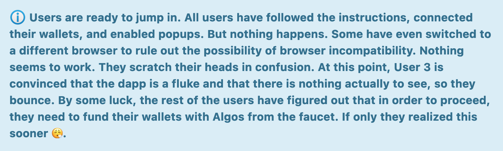

 

<h4>🌸 STEP 4</h4>

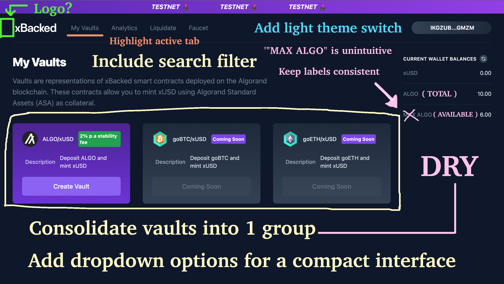  

 

<h4>🌸 STEP 5</h4>

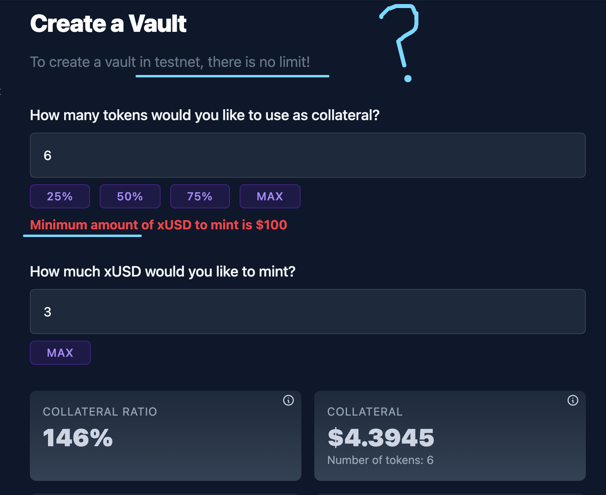  
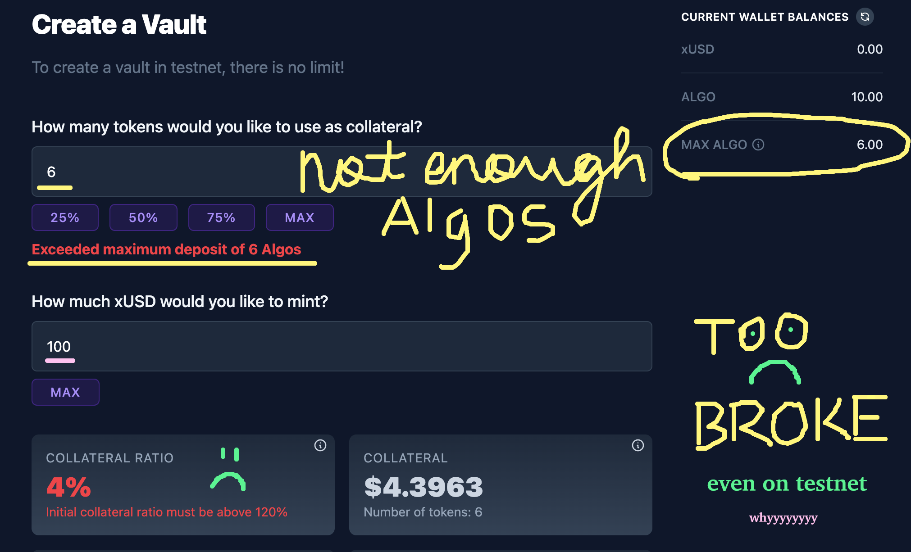  
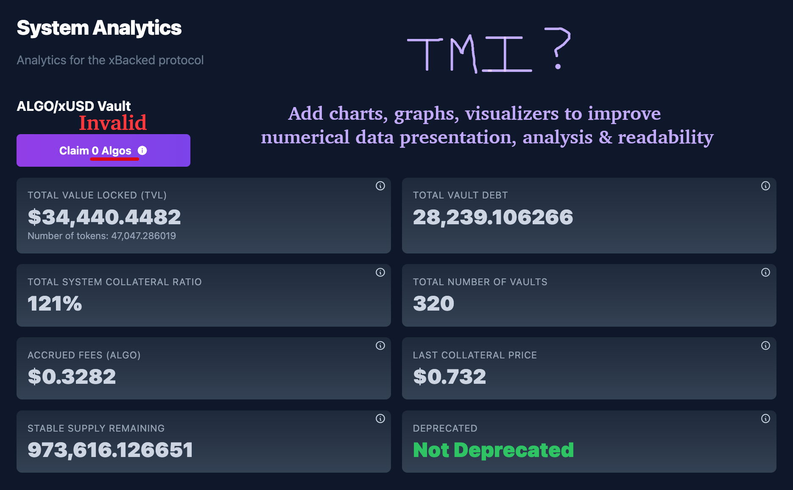  
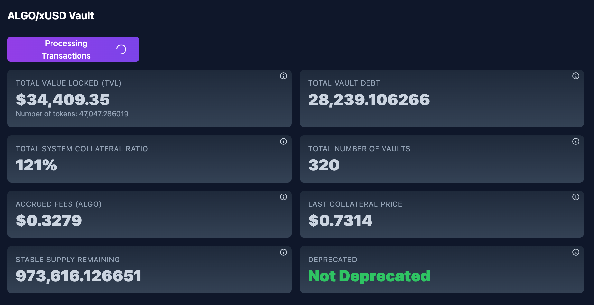  

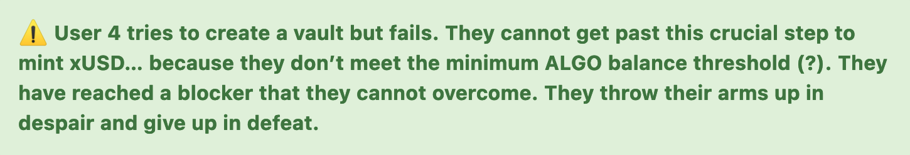
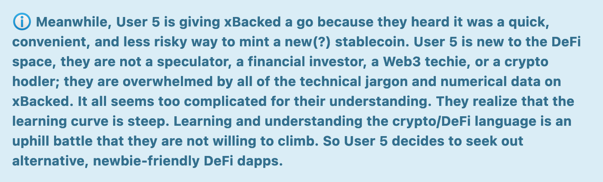

 

<h4>🎉 The Last One Standing🧍‍♂️</h4>

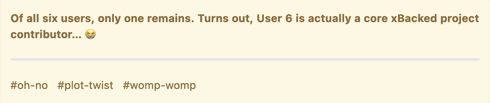

<table>
  <tr>
    <th style="text-align:left" width='300'>&nbsp;&nbsp;&nbsp;&nbsp;&nbsp;&nbsp; <video src="https://user-images.githubusercontent.com/91639796/169176907-80a8e982-6a37-49e9-83c7-403265247be0.mp4" controls width='450'>
  Your browser does not support the video tag.
</video> </th>
  </tr>
</table>

<!-- <audio controls>
  <source src="https://www.orangefreesounds.com/wp-content/uploads/2014/10/womp-womp.mp3" type="audio/mpeg">
Your browser does not support the audio element.
</audio>

&nbsp; <a href='https://orangefreesounds.com/womp-womp' target='_blank'>Source</a>: <a href='https://www.freesound.org/people/Benboncan/' target='_blank'>Benboncan</a> -->

  

## **🤷🏻‍♀️** Overall User Sentiment

<table width='300'>
    <tr>
        <td width='250' align='center'>  </td>
        <td width='300'>  </td>
        </tr>
</table>
<table>
    <tr>
        <td width='550px' align='center'>
            Source: GIPHY [<a href='https://media.giphy.com/media/xThuW4BaAA2f7nRvoc/giphy.gif' target='_blank'>1</a>][<a href='https://media.giphy.com/media/XQvhpuryrPGnK/giphy.gif' target='_blank'>2</a>]
        </td>
<!--         <td width='80'></td> -->
      </tr>
</table>
 
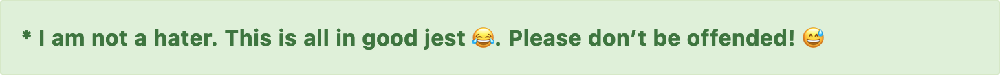

 

## **🤔** Personal Thoughts + Feedback

- Project + documentation are too technical and too complex for mass adoption. It is better to oversimplify than overcomplicate (ELI5). Pay attention to the wording, messaging and data being presented. Does it welcome all users or only some? What can the dapp do for the ordinary, non-technical user who just wants to mint a token and invest without being overwhelmed with additional data? Users may not necessarily know or care to know about all the finer technical details. Consider this POV when you are designing the dapp. Perhaps, you can split the dapp into two views - a basic, minimalist mode + an expert detailed mode. Or give users the option to show or hide data by (un)checking filters.

- A comprehensive intro + an easy-to-follow, onboarding starter guide is needed. Include a step-by-step tutorial or embed a video explainer, like this <a href='https://youtube.com/watch?v=rg7MLQ4WcHc' target='_blank'>2-minute walkthrough video</a>. That would be a solid start. Keep in mind that most new users will bounce before they go out of their way to research an unfamiliar brand or learn to use a new dapp. (This is assuming that they know what the project is even about before they launch the dapp in browser). The goal should be to onboard users with the least resistance possible (the less steps they have to take on their own to figure out what to do & how to do it, the better). Getting started should be quick and simple. Having a landing page that effectively hooks, informs and converts does wonders when it comes to attracting, educating, and selling to users. Take a look at these <a href='https://dribbble.com/tags/defi_landing_page' target='_blank'>DeFi landing page templates</a> for inspiration.

- The only reason I knew I needed to request Algos from the faucet is because I decided to look up xBacked explainer videos online. Fortunately, I found two walkthrough videos on YouTube. (This is unsolicited feedback, but I suggest minimal video edits, erring on the side of conservative for how-to-use tutorials. I found it difficult to watch with all the text + sound effects. They made me slightly nauseous, although this is personal preference).

- Why should users connect their wallets? How does the app benefit them? Add a one-liner pitch above the fold that summarizes what xBacked is, what it does, and who it's for. Keep it simple. Don't assume that every user is well-versed in DeFi. **✨** ELI5 **✨**. Aim to leave a positive, lasting first impression.

- Diversify the presentation of vault + system analytics with charts **📈**, graphs **📊**, images **📸** and infographics **💁🏻‍♀️🗯**. Numerical data lists lack the same charm **🙁**

- xBacked's branding + messaging are not in alignment. The written copy has a very serious & lackluster undertone, whereas the bright colors and playful theme/web design give off a different vibe. I don't think the UI design suits the serious nature of a DeFi platform that will potentially involve large sums of currency exchanges and funds stored in collaterized vaults. With the <s>dinosaur</s> goanna mascot, bright colors, animations & sound effects (not sure if these effects are part of the UI design or if they were clips inserted as video edits as I didn't get that far - I assume the former), the testnet design seems more fitting as a landing page for GameFi, WriteFi (fictional novel/scifi), or KidEduFi (children's education/primary school learning) - ya I made up the last two terms. It may be hard to take seriously... I'm not saying that a bland, professional corporate theme is desirable (I don't believe it is), but the UI needs to strike the right balance between cool/fun and professional/serious. I would add & revise the copy so that it is less plain/dull and more exciting/conversational, while still being informational, if that makes sense. I expand on this point in the **<a  href='#pitch'>next section</a>**.

- Consider using xBacked's mascot as a 'tour guide' that introduces and explains each step and module in an interactive onboarding guide. Atm, it's just floating around and unexpectedly popping up in random places without doing much. There is also a lot of empty, negative space, which should be filled with  content prior to funded wallet connection. Combine the animations with an educational quest/tutorial to make it a more integrated, interactive & enjoyable user experience. Maybe offer a tokenized reward/points system that could drive incentive to complete quests/missions. 

- What are 'opt-in assets' in xBacked? Further disclosure is needed.

- MyAlgoWallet + Algorand Official Wallet both point to the same url. Change the url for one of them or remove both options if they are one and the same.

- Give users the option to connect to an existing wallet when they click 'Connect Wallet'. There is no button to sign in until the user clicks "Set Up Wallet". Only then can they import their seed phrase to connect their account. Also, adding another wallet and switching between wallets would be a useful feature to have.

- Please review the suggestions I added to the screenshot below:

&nbsp; &nbsp; &nbsp; &nbsp; 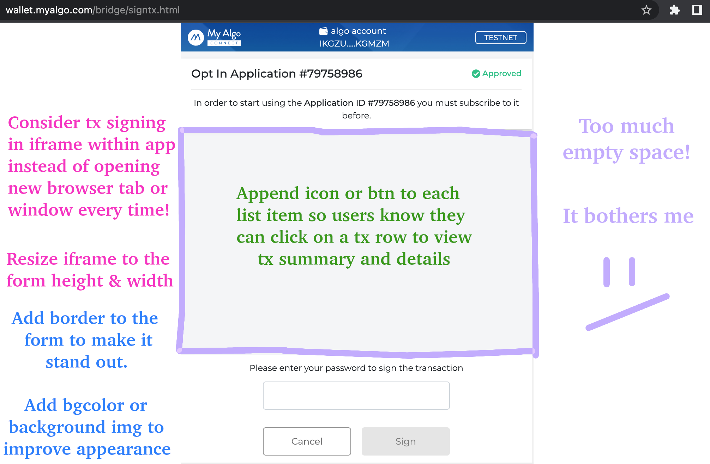 

 

- Add divider(s) or highlight rows alternately for improved readability:

<table width='300'>
    <tr>
        <td width='300' align='center'> 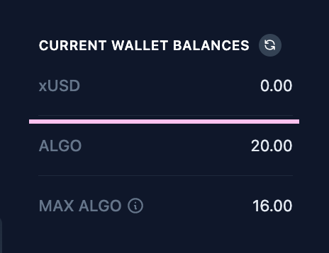 </td>
        <td width='300'> 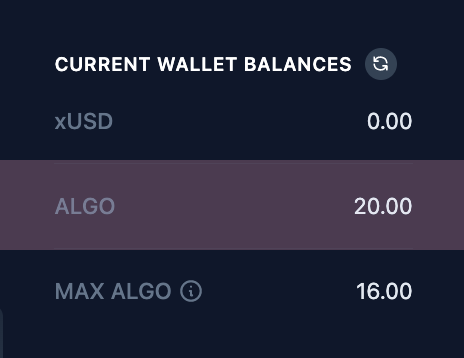 </td>
        </tr>
</table>

- Please refer to my notes on the screenshots in <a href='#user-flow'><strong>Section 1</strong></a>. I don't feel like retyping it all.

- It takes a long time to load and reload each view. Improve performance time by loading data once, storing in state, and allowing manual refresh for any updates in modules.

- Resolve all the errors logged in console. In particular, **`viewVaultState`** err count kept increasing:

&nbsp; &nbsp; &nbsp; &nbsp; 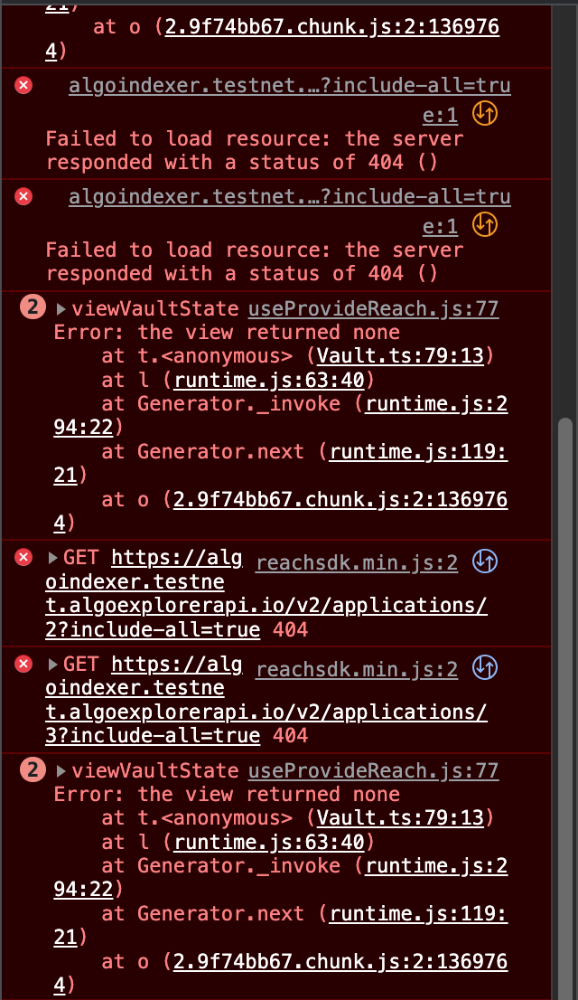 
&nbsp; &nbsp; &nbsp; &nbsp; 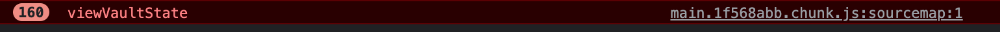

 

- I think that the xBacked team should prioritize functionality + user education before focusing too much on the frontend design, especially if resources are limited. Start with a boilerplate/open source template & then add in the bells and whistles later in future iterations of the project after launch on mainnet.

 

<h2 id='pitch'>♠️ xBacked Brand + Pitch (Copywriting)</h2>

Awareness is the first stage in the user journey. I suggest rethinking the xBacked brand and rewriting the introductory pitch, as they are integral components of the UI/UX design. The following copy is what all potential and existing users will read when they get to the bio section of xBacked's pages, docs, and socials. Because the copywriting forms a prospect's initial impression of the brand (it was my first informal introduction to xBacked), it is crucial to get right. 

Now, let's take a closer look at xBacked's **'About Us'** description 🧐 

&nbsp; &nbsp; &nbsp; &nbsp; 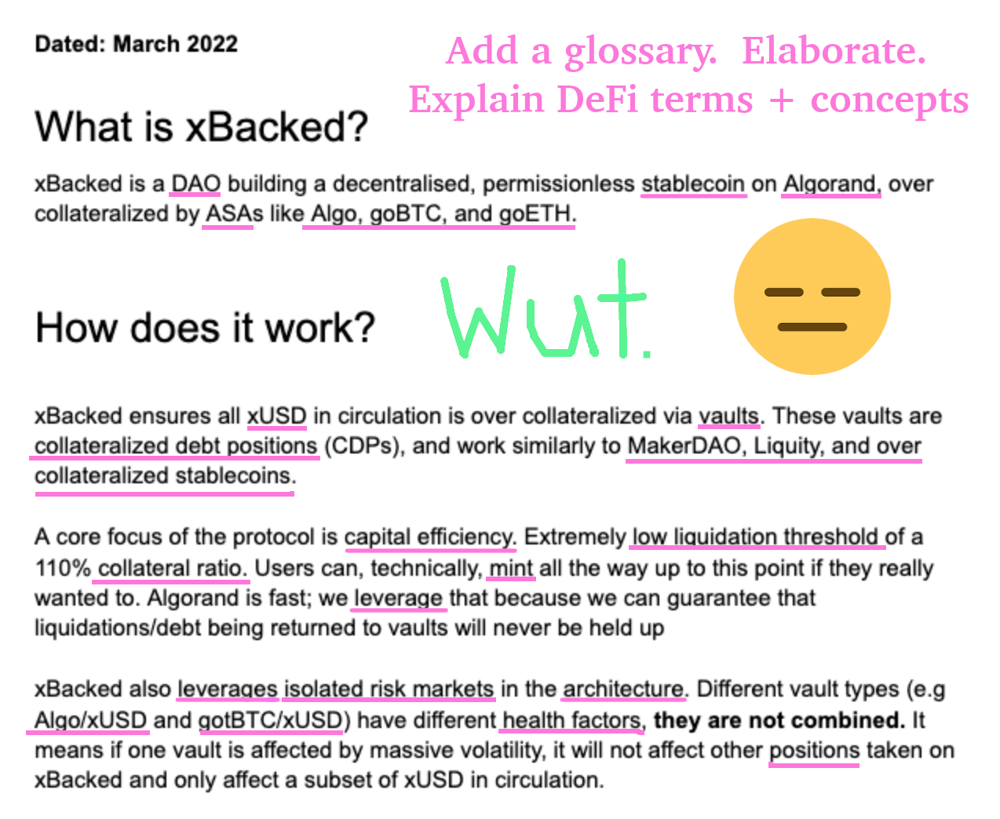  

How do you feel when you read this copy? 👆 
Good? Happy? Excited? Convinced? Indifferent?

How do you want users to feel when they read this copy?

Does anything stand out to you in particular? 
Is there anything you would change about the current documentation?

 

I'll tell you what I think...

The description is <strong>too dry</strong> & <strong>too technical</strong>! **🥱**

It's missing a story — a deeper human connection that pulls on heartstrings **💘**, a vision that inspires **🚀**, powerful words that move us and make our eyes well up **🥺**, inclusive messaging that invites each and every one of us to join and contribute **🎉**. It's missing the <strong>X</strong> factor in <strong>x</strong>Backed.

I had to force myself (yes, \*force\* **😁**) to read the doc \*several\* times before it vaguely clicked in my mind. And I \*still\* don't get the full scope of the project... because it raises more questions than it gives answers.

The current copy sounds more like an opening statement extracted from a whitepaper than a convincing sales pitch to a potential user. It assumes knowledge of crypto concepts and CeFi + DeFi terms like: ASAs, Algo, goBTC, goETH, xUSD, collateralized debt positions (CDPs), DAO, MakerDAO, Liquity, over collateralized stablecoins, collateral ratio, low liquidation threshold, isolated risk markets, leverage, mint, vaults, vault types, etc. Don't assume that the reader is as knowledgeable or as smart as you!

<table>
    <tr>
        <td width='350' align='center'> 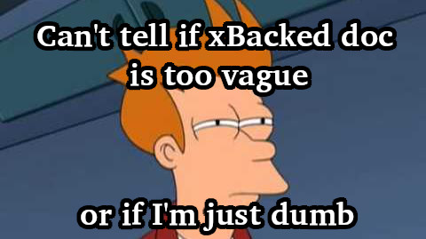 </td>
        <td width='350'>  </td>
        </tr>
</table>

How did I feel after reading the doc? Not good! Confused. Stoopid. Intimidated. Uninterested. Surely, I can't be the only one feeling this way? If we don't understand what xBacked is (and if we don't feel interested enough to learn), how can we be convinced to adopt the project, regardless of how amazing or groundbreaking it may be?

Technical complexity is not necessarily better. Spell everything out, include a glossary of terms, and/or reference resources that expand on each topic. Embed a short video explainer + educational content in bite-sized GIFs, screenshots, and infographics to help get the main points across. Notice how <a href='https://www.notion.so/' target='_blank'>Notion</a> and <a href='https://www.airtable.com/'>Airtable</a> introduce their products - they both use informational GIFs and templates prefilled with sample data that users can visualize and understand immediately.

Think about how you can simplify the overall message and wording so that \*anyone\* can understand. My impression of xBacked is that it is not newbie friendly but daunting and uninviting to newcomers in the crypto DeFi space. I believe that the current branding and messaging will only attract and recruit from the existing Web3 community of DeFi/crypto enthusiasts while excluding everyone else outside of the cryptosphere (i.e. the majority of the population). Is xBacked aiming for mass adoption or is the DAO focused on niche recruiting of crypto natives only? Designing the UI for each of these two audiences will require a different approach. 

 

Here's an exercise to try: 

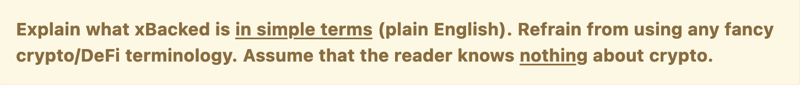

If you can get a non-crypto reader to understand the description on the first read and explain it back to you, enthusiastically, **without relying on any external source**, then that is a good indicator of a successful pitch **🙌** .

 

<strong>Other questions to address:</strong>
    
- Who is xBacked's target demographic?
- Why should someone choose to mint xUSD with xBacked? 
- Why does the ecosystem need another stablecoin by another DAO that most folks have probably never heard of before? Is this the first & only stablecoin on Algorand? Is that what makes it special? Include a comparison chart listing the pros and cons of xBacked's stablecoin vs more popular stablecoins - xUSD vs DAI vs USDC vs USDT, xBacked vs MakerDAO
- What purpose does the DAO and collaterized cryptocurrency vaults serve? 
- What else does xBacked/xUSD offer? Why are over collaterized stablecoins needed? 
- "A core focus of the protocol is capital efficiency." - elaborate on this claim. What are the other core  values and differentiators of the protocol? List these out and go into greater detail.
- How can xBacked "guarantee that liquidations/debt being returned to vaults will never be held up"?
- What is xBacked DAO - introduce your team, background, story, vision, why the DAO is named xBacked, how xBacked was founded, what the goanna mascot represents, what sets this project and community apart from the rest, include any interesting, memorable facts about xBacked, anything that builds credibility... 
 

There doesn't seem to be much to go off of right now. xBacked's intro doc is too short. I'm betting that most people will not take the extra time to go through the links listed at the end to learn more about the project if the copy does not grab their attention within the first minute. Have you ever read an article that left you more confused after reading it? This is where we're at with the current copy imo <strong>😬</strong>. But fret not, there is always room for improvement! 😎
 

<table>
    <tr>
        <td width='350' align='center'>  </td>
        <td width='350'>  </td>
        </tr>
</table> 

This is the opening sentence: "xBacked is a DAO building a decentralized, permissionless stablecoin on Algorand..." But nowhere in the doc does it actually specify what stablecoin that is! Sure, it may be obvious to you that xUSD is the stablecoin (no duh <strong>🙄</strong>) ... but really, it is not as intuitive as you may think.

 

The website should have the following pages: **`About`** + **`FAQ`** + **`Contact`**. Include the info on these pages with xBacked's one-liner pitch/hook on the home page.

 

See how this DeFi startup <a href='https://blog.minke.app/why-minke-exists/' target='_blank'>introduces its app</a>, and then proceeds to explain (in very simple terms) what DeFi is, why it is needed, and how it compares to CeFi in a <a href='https://blog.minke.app/what-is-defi-and-why-do-we-need-it/' target='_blank'>followup article</a>. Notice how the authors do not assume advanced level knowledge or technical fluency of their readership. I suggest being more attentive and intentional about the vocabulary and writing style used. Aim to keep the barrier to entry low.
 

<strong>Branding + User Acquisition</strong> - Doge DAO attracts and connects a community of dog lovers that appreciates memes and humor. Doge has a viral, shareable, memeworthy story (quite literally). I mention Doge because I recently learned about Doge's story through their L3 contest + docs (in the same way that I discovered xBacked). But the key difference is that with Doge, I was able to understand their vision, their project, and their story almost instantly. It helped that learning about Doge was engaging and 'fun'. And I came in thinking that Doge was some scam $hitcoin 😂 (my bad) ... so it goes to show that impressions can and do change in an instant with  powerful (re)branding, strategic marketing, engaging education, and creative storytelling. 
    
I suggest referencing Doge's docs & informational content (which are varied in the forms of a Medium article, a Twitter thread, and an entertaining, short-form video) to pull inspiration from their work. xBacked should also release different forms of educational content and give its mascot some personality to make the project more interesting and relatable. First, think through what xBacked's brand should be/represent. And then incorporate this into the UI.
    
Now go get 'em! 

 

##  xUSD vs XUSD

xUSD is <u>**not**</u> <a href='https://docs.xusd.money/' target='_blank'>XUSD</a>, right? (I didn't realize at first that these two are not identical or interchangeable. Apparently, XUSD is a "partial-collateralized stablecoin", partly backed by collateral and partly backed by algorithm. But xUSD is an "overcollaterized stablecoin". These two tokens are easily confusable. It's odd that both tokens are marketed as being capital efficient for... opposite reasons. This should be specified & clarified somewhere in xBacked's docs.

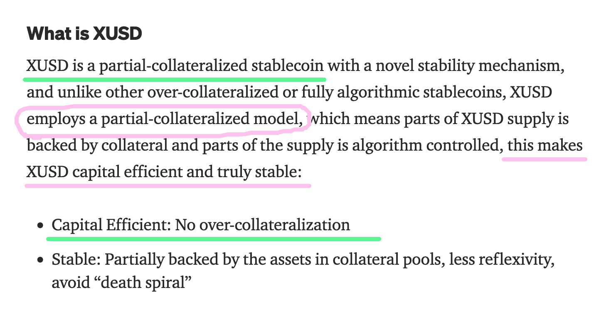 
&nbsp; &nbsp; &nbsp; &nbsp; Source: <a href='https://medium.com/xusdstable/xusd-an-innovative-decentralized-stablecoin-with-fair-launch-mechanism-e94b508025b5'>Medium Article</a>

 

**Digital Marketing** - xUSD and XUSD are only off by one case sensitivity, which is not ideal when it comes to SEO. When I look up 'xUSD', all but one of the top ranked results on SERP are for 'XUSD'. xUSD.com (or xusd.com) is a personal finance + retirement blog tied to an aged domain that was created nearly two decades ago in 2005. The domain expires on October 31, 2022 05:50:56 and will be auctioned past the 30-day grace period if it is not renewed by the current owner. It may be of interest to xBacked DAO to purchase the domain near expiry, if feasible, to reap the benefits of a branded domain on a top-tier .com TLD + organic search traffic. This isn't a UI suggestion but a long-term vision for the online marketing + branding of xBacked's stablecoin project.

 

## **🍀** Closing Remark

I think that one of xBacked's biggest hurdles may be stepping out of the trenches and experiencing the app from new users' POV. User testing and surveying can aid in the design and development of xBacked's project. I believe the DAO is on the right track by requesting external feedback (like through this contest).

Hopefully you can take my raw user feedback as constructive criticism towards improving the product. Good luck! **💖**

 

